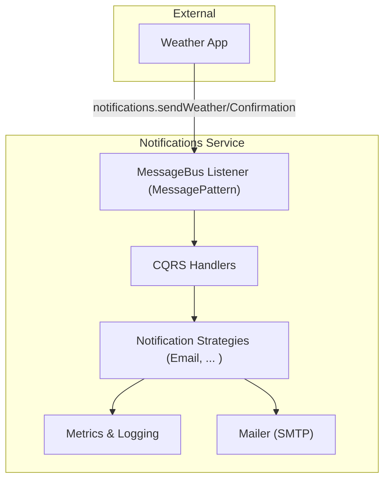
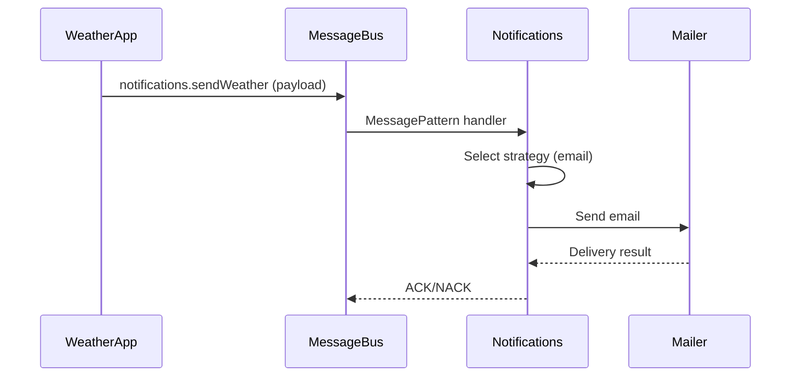

# System Design: Notifications Microservice

---

## 1. System Requirements

### Functional Requirements

- Receive notification commands (confirmation, weather updates) from other services via RabbitMQ.
- Send email notifications to users (confirmation, weather updates).
- Collect and expose metrics for sent/failed notifications.
- Support extensible notification strategies (e.g., email, SMS, push).

### Non-Functional Requirements

- Reliable: Ensure delivery of notifications (with retries).
- Scalable: Support high throughput (up to 10,000 notifications/hour).
- Observable: Provide metrics and logging for monitoring and troubleshooting.
- Isolated: No direct dependencies on other microservices' internals.

### Constraints

- All communication is asynchronous via RabbitMQ.
- Email delivery via SMTP.
- Each service has its own configuration and database (if needed).

---

## 2. High-Level Architecture

---

## 3. Detailed Component Design

### 3.1 Message Controller

- Receives commands via RabbitMQ (MessagePattern).
- Delegates execution to appropriate CQRS handlers.

### 3.2 CQRS Handlers

- Process notification commands (send confirmation, send weather update).
- Select the appropriate notification strategy (email, etc).
- Generate message templates.

### 3.3 Notification Strategies

- Implement the Strategy pattern for different delivery channels.
- Email strategy uses SMTP and Pug templates.
- Easily extensible for new channels (SMS, push, etc).

### 3.4 Metrics & Logging

- Decorators and services collect metrics (success/failure counts).
- All send attempts and errors are logged.

### 3.5 Mailer

- Asynchronous email delivery via SMTP.
- Uses templates for email content.

---

## 4. Sequence Diagram

### 4.1 Notification Delivery

---

## 5. Deployment Architecture

- NestJS (CQRS, DI, RabbitMQ integration).
- Docker containerization.
- SMTP server.
- Prometheus + Grafana for metrics.
- Loki for logging.

---

## 6. Monitoring & Metrics

- Prometheus scrapes notification metrics.
- Grafana dashboards for notification delivery and errors.
- RabbitMQ queue health and message rates are monitored.
- Loki collects logs from the service.

---

## 7. Testing Strategy

- [ ] Unit tests for handlers, strategies, decorators.
- [ ] Integration tests for RabbitMQ and SMTP interaction.
- [ ] E2E tests for the full notification delivery flow. 