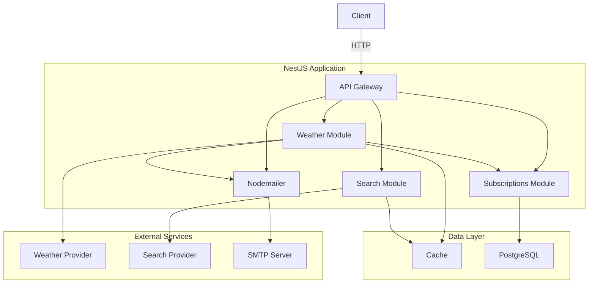

# System Design: Weather App

---

## 1. System Requirements

### Functional Requirements

- Users can subscribe to weather updates on website and confirm their email.
- Cron job functionality to schedule email updates depending on frequency.
- Getting actual weather data by city.
- Viewing weather on website.
- Users can unsubscribe from weather updates.

### Non-Functional Requirements

- Scalable: <= 100,000 subscribers.
- Performance: < 200ms response time for API requests.
- Maintainable: Code should be modular and easy to understand.
- Secure: Provide token via email for subscription confirmation and unsubscribe functionality.

### Constraints

- Minimal architecture complexity.
- Caching weather and city data.

---

## 2. Load Estimation

### User Load

- Subscribers: 100,000
- Active Users on website: 3,000
- API Requests per second: 100

### Data Load

- Subscription Data Size: 200 bytes
- Cached Weather Data Size (for 14 days): 5 KB
- Cached City Data Size: 1 KB

### Bandwidth

- Incoming: 1 Mbps
- Outgoing: 5 Mbps
- External API: 30 Mbps

---

## 3. High-Level Architecture



---

## 4. Detailed Component Design

### 4.1 API Gateway

**Responsibilities**:

- Handle incoming HTTP requests.
- Validation data.

**Endpoints**:

```
GET /api/search/?city={city} - Search city by name
GET /api/weather?city={city}&=lat={lat}&lon={lon}&&days={days} - Get weather data for a city
POST /api/subscribe - Subscribe to weather updates
POST /api/confirm/{token} - Confirm subscription with token
POST /api/unsubscribe/{token} - Unsubscribe from weather updates
GET /api/docs - API documentation
GET /api/metrics - Application metrics
```

### 4.2 Scheduler

- Send weather updates to all subscribers depending on frequency.

### 4.3 Notifier

- Send emails for subscription confirmation and weather updates.

### 4.4 Weather API Integration

**Caching Strategy**:

- Use Redis.
- Weather data is cached for 1 minute.
- City data is cached for 5 seconds.

### 4.5 Database

**Schema**:


---

## 5. Sequence Diagrams

### 5.1 Subscription


### 5.2 Unsubscription


### 5.3 Weather Updates


---

## 6. Deployment Architecture

- NestJS for the backend.
- Angular for the frontend.
- Docker for containerization.
- PostgreSQL for the database.
- Redis for caching.
- Nodemailer for email notifications.
- Prometheus for monitoring.
- Loki for logging.
- Grafana for metrics and logs visualization.

---

## 7. Testing Strategy

- [x] Unit tests for each module.
- [x] Integration tests for API endpoints.
- [ ] E2E tests for the entire flow.